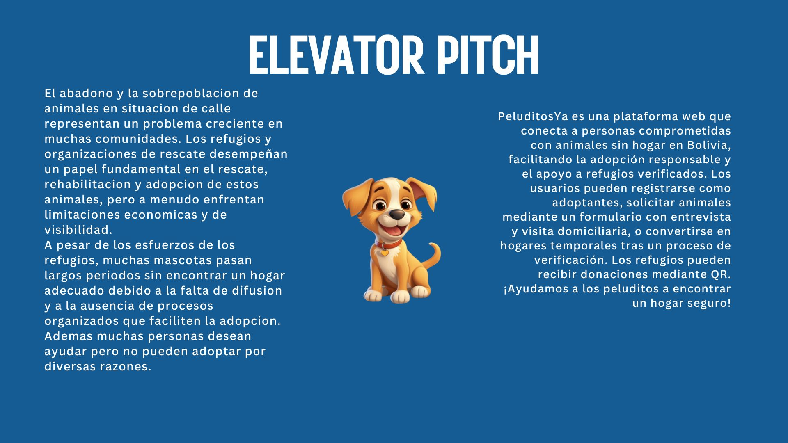

# 🐾 PeluditosYa - Plataforma de Adopción de Animales
## Elevator Pitch



<!--  *(Reemplazar con logo real)* -->

Plataforma web para conectar adoptantes responsables con animales sin hogar en Bolivia. 
Desarrollada con **Angular 15+** (frontend) y **Spring Boot 3.2+** (backend), usando **PostgreSQL** como base de datos.

## 🌟 Características Principales
### Para Adoptantes
- Registro con validación de campos
- Búsqueda de animales por especie, edad y ubicación
- Solicitud de adopción con formulario
- Visualización de historial médico y fotos de animales

### Para Refugios
- Registro con verificación de documentos
- Gestión de perfiles de animales (subir fotos, historial médico)
- Generación de códigos QR para donaciones

### General
- Notificaciones por email para cambios de estado
- Interfaz responsive y accesible

## 🛠 Tecnologías Utilizadas
| **Categoría**     | **Tecnologías**                                                                 |
|--------------------|---------------------------------------------------------------------------------|
| **Frontend**       | Angular 15+, TypeScript, Angular Reactive Forms, CSS3                           |
| **Backend**        | Spring Boot 3.2+, Spring Data JPA, Spring Web                                   |
| **Base de Datos**  | PostgreSQL 15                                                                   |
| **Herramientas**   | Postman, Maven, Angular CLI, Git                                               |

## 🚀 Instalación Local
### Requisitos Previos
- Java JDK 17
- Node.js 18+ y Angular CLI 15+
- PostgreSQL 15+
- Maven 3.6+

### Pasos de Configuración
1. **Clonar Repositorio**
   ```bash
   git clone https://github.com/tu-usuario/peluditos-ya.git
   cd peluditos-ya
   ```

2. **Configurar base de datos (Windows)**
   ```Terminal
   net start postgresql-x64-{version de postgreSQL que tenga}
   psql -U postgres
    CREATE USER peluditos_user WITH PASSWORD 'password123';
    CREATE DATABASE peluditosya_db owner peluditos_user;
    GRANT ALL PRIVILEGES ON DATABASE peluditosya_db TO peluditos_user;
    \c peluditosya_db peluditos_user
    ```
    
3. **Configurar base de datos (Linux)**
   ```bash
   sudo -u postgres psql
    CREATE DATABASE peluditosya_db;
    CREATE USER peluditos_user WITH PASSWORD 'password123';
    GRANT ALL PRIVILEGES ON DATABASE peluditosya_db TO peluditos_user;
    ```

4. **Backend (Spring Boot)**
   ```bash
    cd peluditos-ya-server
    # Configurar application.properties según tu entorno
    mvn clean install
    mvn spring-boot:run
    ```

5. **Frontend (Angular)**
   ```bash
    cd peluditos-ya-client
    npm install
    ng serve

## 🔧 Estructura del Proyecto
### Backend(peluditos-ya-server)
```bash
src/
├── main/
│   ├── java/com/peluditosya/
│   │   ├── config/          # Configuraciones de seguridad y beans
│   │   ├── controller/      # REST Controllers (Auth, Animal, etc)
│   │   ├── model/           # Entidades JPA (User, Animal, Shelter)
│   │   ├── repository/      # Spring Data JPA Repositories
│   │   └── service/         # Lógica de negocio
│   └── resources/
│       └── application.properties
```

### Frontend(peludito-ya-client)
```bash
src/app/
├── components/
│   ├── login/               # Componente de inicio de sesión
│   └── register/            # Componente de registro
├── services/                # AuthService, AnimalService
└── app.routes.ts            # Configuración de rutas
```

## 🔑 Endpoints Clave del Backend

| Método HTTP | Endpoint                          | Descripción                                                                 | Parámetros/Observaciones                          |
|-------------|-----------------------------------|-----------------------------------------------------------------------------|---------------------------------------------------|
| **POST**    | `/api/auth/signup`                | Registro de nuevos usuarios (adoptantes o refugios)                        | Body: `{name, email, password, location, phone}` |
| **POST**    | `/api/auth/login`                 | Autenticación básica                                                        | Body: `{email, password}`                         |
| **GET**     | `/api/animals`                    | Obtener listado completo de animales disponibles                           | Opcional: Paginación                              |
| **GET**     | `/api/animals/search`             | Búsqueda filtrada de animales                                              | Query Params: `?species=&age=&location=`          |
| **POST**    | `/api/animals`                    | Crear nuevo registro de animal (solo refugios verificados)                 | Body: `{name, species, age, medicalHistory}`     |
| **POST**    | `/api/adoptions/request`          | Enviar solicitud de adopción                                               | Body: `{animalId, adopterId, message}`           |
| **GET**     | `/api/shelters/{id}/donation-qr`  | Obtener QR para donaciones a un refugio específico                         | Path Variable: ID del refugio                     |
| **PUT**     | `/api/shelters/{id}/verify`       | Verificar refugio (solo administradores)                                   | Body: `{status: "APROBADO"/"RECHAZADO"}`         |


## 📄 Licencia
Distribuido bajo licencia MIT. Ver `LICENSE` para más detalles.